# AushadhiAI: AI-Powered Prescription Analysis System

## Introduction

AushadhiAI is an innovative solution that leverages artificial intelligence and Azure Computer Vision to decode doctors' handwritten prescriptions, making medication information accessible and understandable for patients. This technical deep dive explores the architecture, implementation details, and key features of the AushadhiAI system.

## System Architecture

AushadhiAI employs a modern, scalable architecture that separates frontend and backend concerns while leveraging cloud services for advanced AI capabilities.

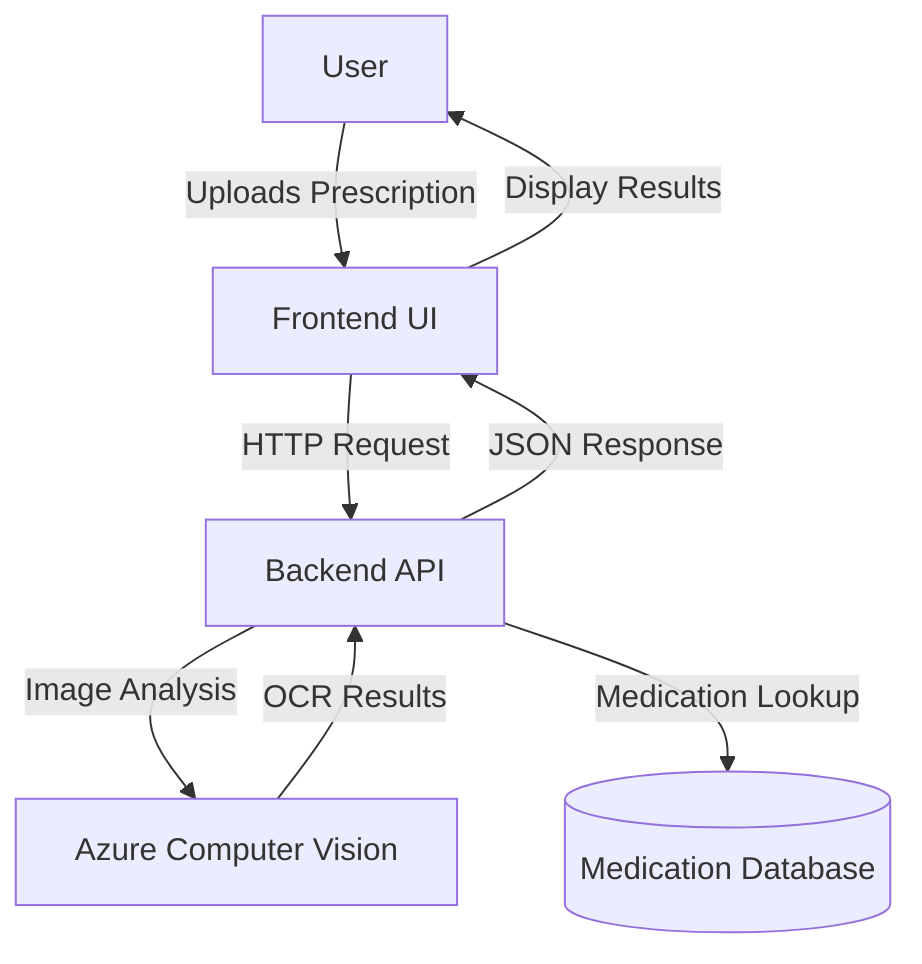

### Key Components

1. **Frontend**: HTML, CSS, and JavaScript providing a responsive user interface
2. **Backend API**: FastAPI application providing RESTful endpoints for image analysis  
3. **Azure Vision Service**: Cloud-based OCR through Azure Computer Vision API
4. **Medication Service**: Logic for identifying medications from extracted text
5. **Medication Database**: JSON-based storage of medication information

## Technical Implementation Details

### Backend System

The backend is built with FastAPI, a modern, high-performance web framework for building APIs with Python. It provides several key endpoints:

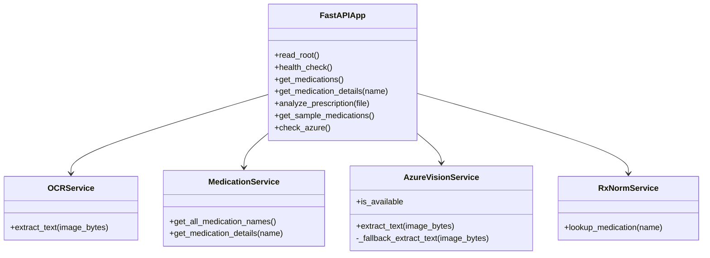

#### Key Backend Components:

1. **app.py**: Main FastAPI application that defines all endpoints
2. **services/azure_vision_service.py**: Handles communication with Azure Computer Vision API
3. **services/ocr_service.py**: Manages text extraction from images with fallback mechanisms
4. **services/med_service.py**: Identifies medications from extracted text
5. **services/rxnorm_service.py**: Integrates with RxNorm for standardized medication information

### Prescription Analysis Process

The prescription analysis workflow involves several steps:

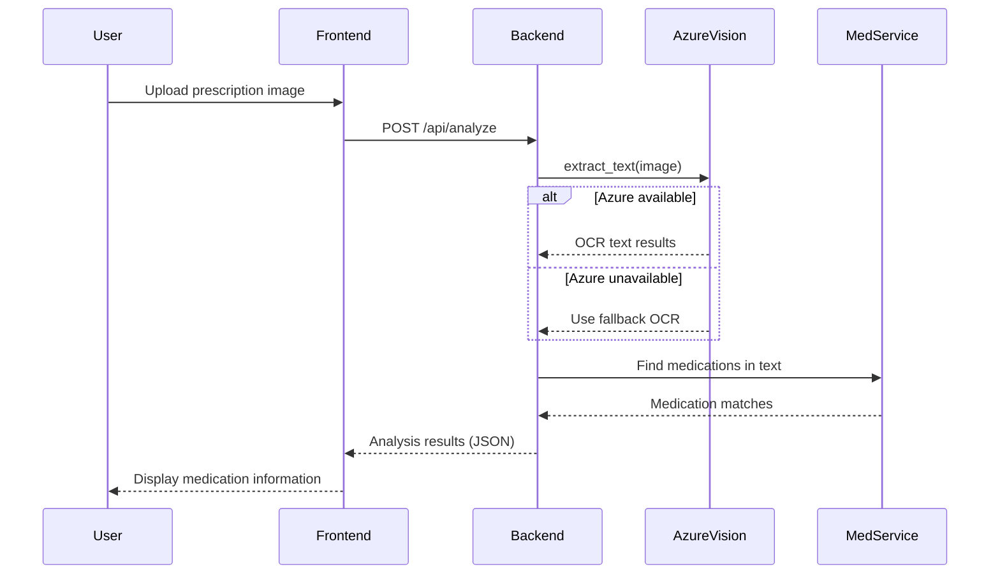

### Frontend Implementation

The frontend provides an intuitive interface for users to upload and analyze prescriptions:

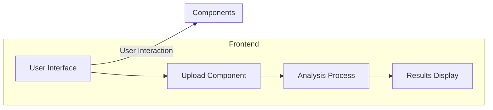

The interface includes:

1. **Upload Section**: For prescription image upload
2. **Processing Visualization**: Shows analysis progress
3. **Results Display**: Presents identified medications and details
4. **Responsive Design**: Works across desktop and mobile devices

## Deployment Architecture

AushadhiAI is deployed using a modern cloud-based infrastructure:

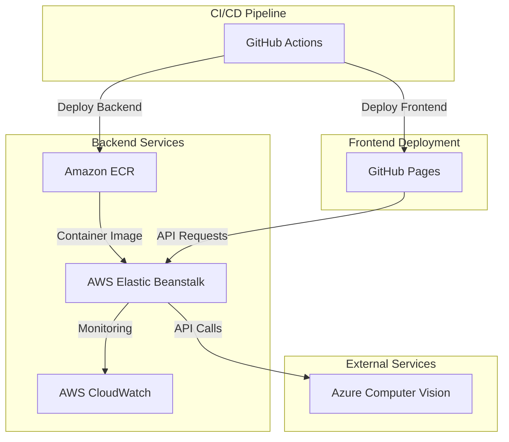

### Deployment Components:

1. **Frontend**: Hosted on GitHub Pages (static hosting)
2. **Backend**: Containerized with Docker and deployed on AWS Elastic Beanstalk
3. **CI/CD**: Automated deployment using GitHub Actions
4. **Monitoring**: AWS CloudWatch for performance and error tracking

## System Features

### 1. Robust OCR Capabilities

The system uses Azure Computer Vision API for high-quality OCR, with a fallback mechanism for offline operation:

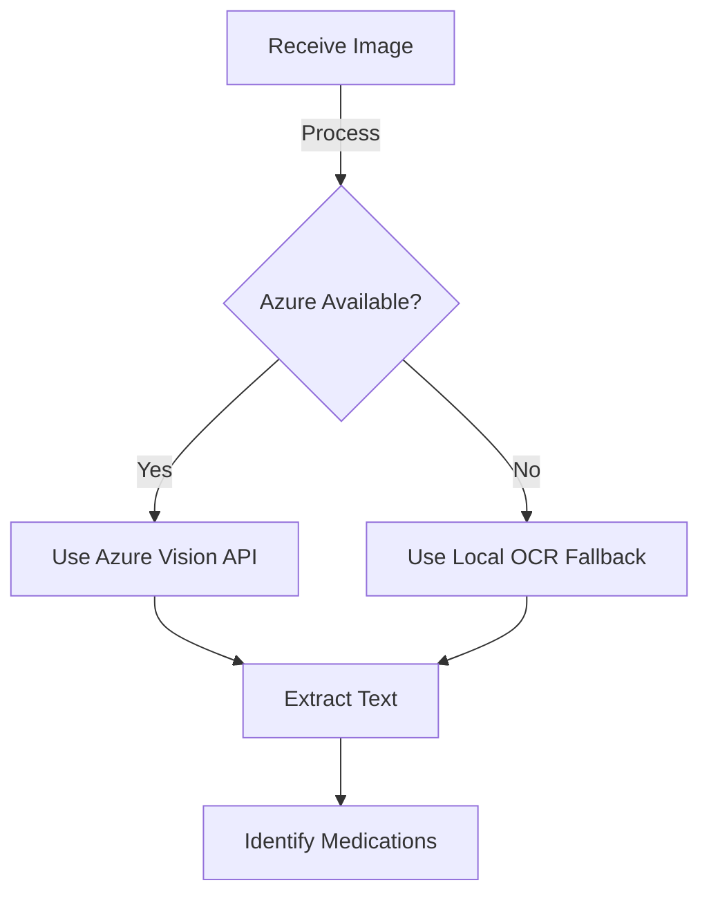

### 2. Medication Identification

The system identifies medications using a combination of techniques:

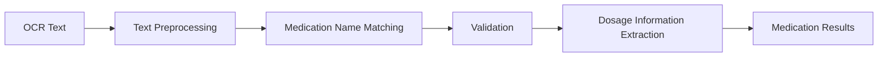

### 3. Error Handling and Resilience

The system is designed with robust error handling:

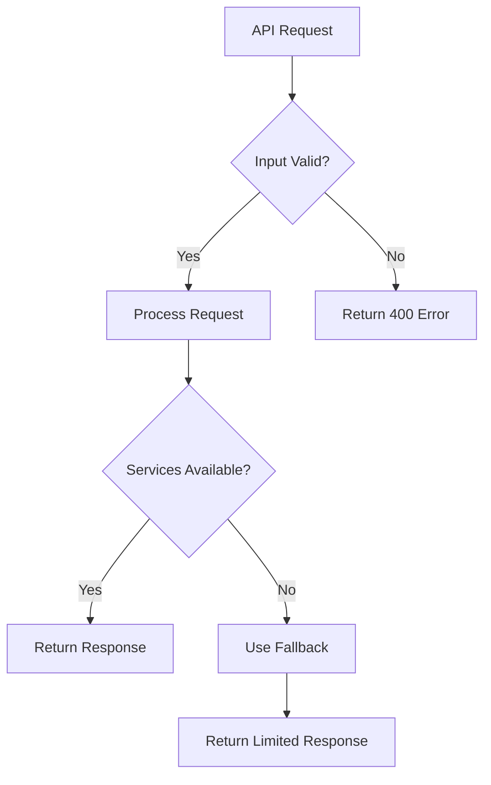

## Performance Considerations

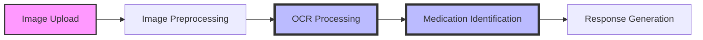

The most computationally intensive parts of the system are:

1. **OCR Processing**: Handled by Azure Computer Vision to offload processing
2. **Medication Identification**: Optimized with efficient text matching algorithms
3. **Image Preprocessing**: Used to enhance OCR accuracy

## Security Implementation

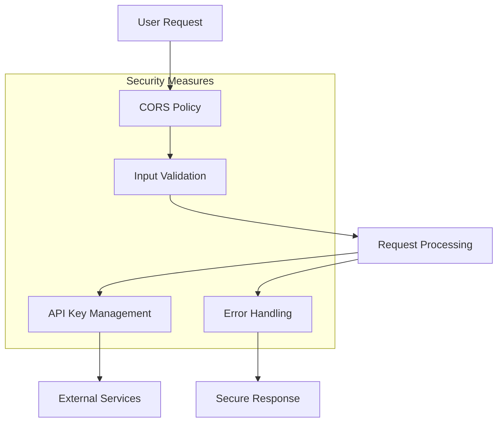

Key security considerations:

1. **CORS Configuration**: Prevents unauthorized cross-origin requests
2. **Input Validation**: Sanitizes and validates all user input
3. **API Key Management**: Securely stores and manages Azure API keys
4. **Error Handling**: Prevents information leakage in error responses

## Future Enhancements

The system is designed for extensibility, with planned enhancements:

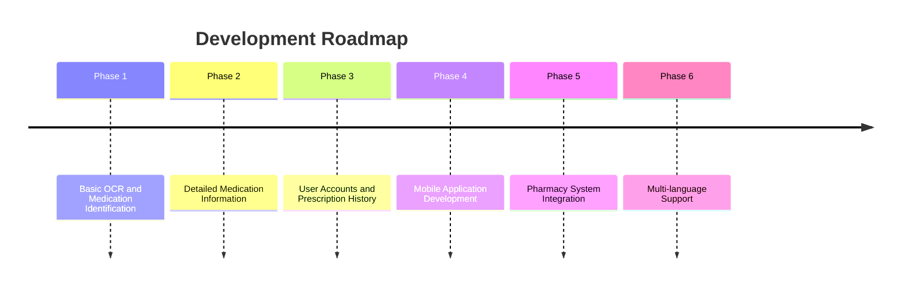

## Conclusion

AushadhiAI represents a powerful application of AI technology to solve real-world healthcare challenges. By combining Azure Computer Vision's advanced OCR capabilities with custom medication identification algorithms, the system effectively bridges the gap between handwritten prescriptions and patient understanding.

The architecture balances performance, reliability, and user experience, with careful consideration given to fallback mechanisms that ensure the system remains functional even when cloud services are unavailable.

Through its modern deployment architecture and thoughtful technical implementation, AushadhiAI demonstrates how cloud-native applications can deliver meaningful solutions to everyday problems. 